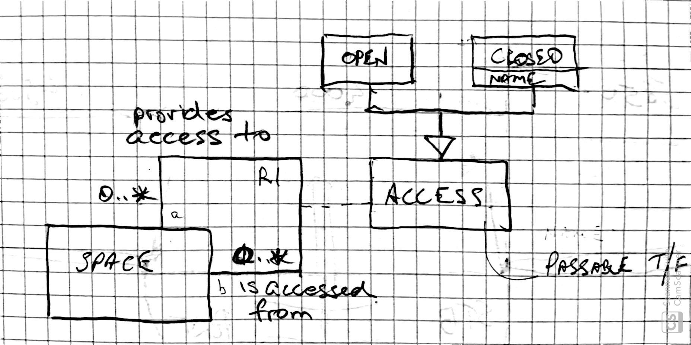

BoatGraph records the layout of a boat as a graph of Spaces and Access ports.

## Data model

The following UML class diagram shows the data structure for BoatGraph.



A Boat consist of many Spaces. Spaces are used for various purposes including human occupation, equipment installation and storage.

An Access is a connection between two spaces. Examples are doorways, hatches and opening of other kinds. Some accesses allow human passage while  others are only allow a humand to reach in (e.g. small storage compartments).

## Usage

First export [your spreadsheet data](https://docs.google.com/spreadsheets/d/1yq5cOqXlXes5evZahwHix0Qybtwbf-atnjoPh10wmd8/edit?usp=sharing) to csv files and copy them to the ``data`` directory

```
cd src
cp ~/Downloads/*.csv ../data
```

Then run the python script to build the ``dot`` file

```
./build_dot.py -s ../data/physical_structure_of_namadgi_3\ -\ Spaces.csv -a ../data/physical_structure_of_namadgi_3\ -\ Accesses.csv > namadgi3.dot
```

Finally run ``dot`` to create the output PDF

```
dot -Tpdf namadgi3.dot -o namadgi3.pdf       
```


## Future work

* Better layout of the PDF graph to allow printing
* Physical coordinates and dimensions for all spaces and accesses
* 3D printing and viewer
* Comments on Space and Access entities
* More descriptive access types
